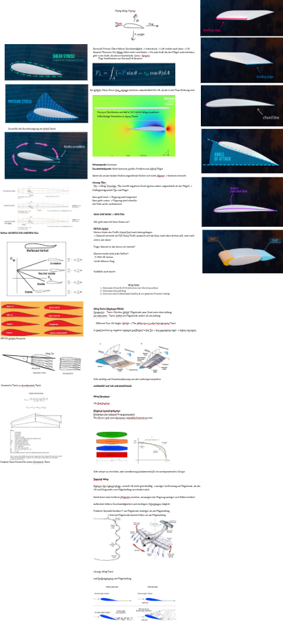

# Aerodynamic Design Rationale

This document explains the key aerodynamic decisions made during the design of the flying wing, including trade-offs considered and reasoning behind each choice.

---

## 1. Configuration - Why a Flying Wing?

A flying wing eliminates the conventional fuselage and tail assembly. Every part of the airframe contributes to lift, unlike a conventional aircraft where the fuselage and tail produce only drag and downforce respectively.

**Advantages for our use case:**
- Higher lift-to-drag ratio (L/D) for a given wingspan
- Lower wetted area -> less skin friction drag
- Simpler structure -> lighter airframe -> more payload capacity

**Disadvantages we had to address:**
- Inherently pitch-unstable without careful design -> solved with reflexed airfoil + sweep
- No rudder -> yaw stability addressed via winglets (design ongoing, see Section 8)
- Limited payload volume -> solved with integrated pod design

**Inspiration:** Skywalker X8: a proven 2.1m flying wing platform widely used in UAV research and FPV. We scaled the design approach to 1.1m wingspan.

---

## 2. Airfoil MH 45

**Selected airfoil:** MH 45 (Martin Hepperle, 1990s)

**Why MH 45?**
The most critical requirement for a tailless flying wing is a **positive pitching moment coefficient (Cm0 > 0)**. Conventional airfoils (e.g. NACA 2412) have negative Cm0, meaning they pitch nose-down without a tail to counteract it. A reflexed airfoil solves this by curving the trailing edge upward, shifting the center of pressure forward.

MH 45 was specifically designed for flying wings and offers:
- Positive Cm0 -> self-stabilizing in pitch
- Good L/D at chord Reynolds numbers corresponding to our cruise speed (~60–80 km/h)
- Well-documented performance data from airfoiltools.com

### Reynolds Number at Cruise

The chord Reynolds number determines which airfoil performs best. At cruise:

Re = (v * c) / ν ≈ 330,000

Where:
- v = 20 m/s (cruise velocity)
- c = 0.25m (mean chord)
- ν = 1.5*10⁻⁵ m²/s (kinematic viscosity of air at 15°C)

This places the wing in the low Reynolds number regime (~100k–500k). MH 45 was specifically optimized for this range.

**Alternatives considered:**

| Airfoil | Cm0 | Notes |
|---------|-----|-------|
| MH 45 | Positive | **Selected** best balanced for wingspans under 2m, 9.85% thickness |
| MH 60 | Positive | Lower Cm0 than MH45 -> requires more washout for same stability level. Potential candidate for future iterations |
| S5010 | Positive | Also used in flying wings, similar size class |

---

## 3. Planform Geometry

### Overall Layout
The wing consists of three sections:
- **Central pod:** 200mm wide, integrated fuselage containing avionics and battery
- **Left/right half-wings:** each 450mm in span
- **Total wingspan:** 1100mm

This X8-inspired integrated pod design reduces aerodynamic drag compared to a separately mounted pod, while keeping the wing structurally simple.

### Chord Distribution

| Location | Z position | Chord |
|----------|-----------|-------|
| Pod edge / wing root | 100mm | 250.88mm |
| Wingtip | 550mm | 120mm |

Note: The original design had a root chord of 280mm at Z=0. After integrating the pod (cutting the wings at Z=±100mm), the effective wing root chord reduced to 250.88mm.

### Wing Area & Aspect Ratio

| Parameter | Value | Calculation |
|-----------|-------|-------------|
| Half-wing area (trapezoid) | ~0.0834 m² | (250.88+120)/2 * 0.45 |
| Pod reference area | ~0.077 m² | 385mm * 200mm |
| Total reference area | ~0.244 m² | 2 * 0.0834 + 0.077 |
---

## 4. Sweep Angle - 33°

**Selected: 33° leading-edge sweep**

For a flying wing, sweep provides **pitch stability** by shifting the aerodynamic center rearward relative to the center of gravity. Without sweep, the aircraft would be pitch-unstable.

33° matches the Skywalker X8 geometry and is a well-proven value for this class of aircraft.

**Leading edge offset at Z = 550mm (original tip):**
```
X_offset = 550 * tan(33°) = 357mm
```

---

## 5. Dihedral

Dihedral was omitted in the initial design iteration. Roll stability is provided by the flight controller (ArduPlane) via active stabilization. Dihedral may be incorporated in a future design revision if passive roll stability proves insufficient during flight testing.

---

## 6. Washout (Geometric Twist) - 2°

**Selected: 2° washout (tip leading edge rotated -2° relative to root)**

A 2° washout ensures that the wing root stalls before the tips. This is critical for tailless aircraft, as it maintains elevon effectiveness during a stall, allowing the flight control system to automatically lower the nose and recover.

```
120*sin(2°) ≈ 4.18mm
```

**Verified in CAD:** After rotating the tip profile by -2°, the trailing edge of the tip profile sits **4mm above the root chordline** confirming the geometric twist is correctly applied.

---

## 7. Weight Estimation

| Component | Estimated Mass |
|-----------|---------------|
| Wings 3D printed | ~250g |
| Pod + electronics tray | ~80g |
| FC + RX + ESC + servos | ~100g |
| Battery (3S 2200mAh LiPo) | ~180g |
| Motor + propeller | ~100g |
| Cables + hardware | ~50g |
| **Total (no payload)** | **~760g** |
| With payload (190g) | **~950g** |

**Target MTOW: ~800g. Absolute maximum: 1000g.**

At 1000g, the estimated stall speed is safely below 45 km/h, requiring a confident but manageable hand launch. At 800g, stall speed drops significantly, giving plenty of margin for slow flight and landing.

### Wing Loading

| MTOW | Wing Loading |
|------|-------------|
| 800g | ~32.8 g/dm² | 
| 1000g | ~41.0 g/dm² | 

---

## 8. Winglets - Design Ongoing

Winglets reduce induced drag by limiting wingtip vortex formation and provide yaw stability by acting as small vertical stabilizers.

**Current status:** The initial trapezoidal winglet design was removed due to CAD geometry issues at the wing-winglet junction. A new winglet design is being developed, with focus on:
- Clean aerodynamic transition from wingtip to winglet
- Printability without support structures
- Effective vortex reduction

The final winglet geometry will be documented here once finalized.

---

## 9. Elevons - Design Ongoing

Elevons serve as both elevator and aileron simultaneously. The only control surfaces on a flying wing.

**Geometry:**
- Span: Z =  mm to Z =  mm per side (Targeting ~20–80% of half-span)
- Chord: ~25% of local wing chord
- Clearance gap: 1mm for hinging

**Note for CFD:** A gap-free version of the model (elevons merged into wing) is used for aerodynamic simulation. The 1mm gap is included in the build model only.

---

## 10. Center of Gravity (CG) Target

The Center of Gravity is the most critical parameter for a tailless flying wing. A CG too far aft will result in an uncontrollable aircraft. The CG is calculated based on the Mean Aerodynamic Chord (MAC) of the swept wing panels.

**Calculated Aerodynamic Parameters using ecalc.ch:**
* **Mean Aerodynamic Chord (MAC):** 193.1 mm
* **MAC Z-Position:** 198.5 mm from the pod edge
* **MAC Leading Edge Offset:** 128.9 mm (distance behind the root leading edge due to 33° sweep)

### Target CG Positions
All measurements are taken from the **Leading Edge of the wing root** (exactly where the wing meets the pod at Z=100mm), measuring straight back towards the trailing edge.

| Parameter | % of MAC | Distance from Root LE | Notes for Flight Testing |
|-----------|----------|-----------------------|--------------------------|
| **Calculated Forward Limit** | 15% | **~158 mm** | **Target for Maiden Flight.** Expected to be highly pitch-stable. |
| **Calculated Aft Limit** | 20% | **~168 mm** | Theoretical rearward limit. |
| **Expected Cruise Sweetspot** | ~17-18% | **~162–164 mm** | To be found during test flights by slowly moving the battery. |


## 11. Summary of Key Parameters

| Parameter | Value |
|-----------|-------|
| Wingspan | 1100mm |
| Pod width | 200mm |
| Effective half-span | 450mm |
| Root chord (at Z=100) | 250.88mm |
| Tip chord (at Z=550) | 120mm |
| Reference area | ~0.244 m² |
| Sweep | 33° |
| Washout | 2° |
| Airfoil | MH 45 (reflexed) |
| Target MTOW | ~800g |
| Max MTOW | ~1000g |
| Target L/D | > 10 |
| Cruise speed | 60–80 km/h |
| Estimated stall speed | ~34–43 km/h |
| Target CG (Maiden) | ~158mm from Root LE |

## 12. Remaining Design Tasks

The current model is prepared for CFD analysis. The following features are still pending for the final build model:

### Mechanical
- [ ] Servo bays cutouts for 2× 9g servos (one per elevon)
- [ ] Motor mount pusher configuration at pod rear
- [ ] Electronics tray
- [ ] Wing-pod attachment 
- [ ] Print segmentation

### Aerodynamic
- [ ] Winglets new design pending 
- [ ] Elevon geometry

## Background & Preparation

Before starting the design, we worked through the aerodynamic fundamentals 
from scratch. Such as airfoil theory, reflexed profiles, wing twist, elliptical lift 
distribution, and the specific challenges of tailless configurations.




