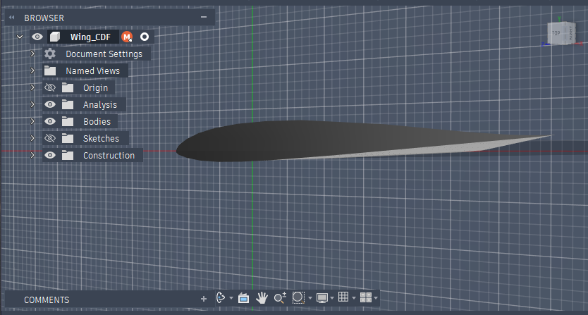
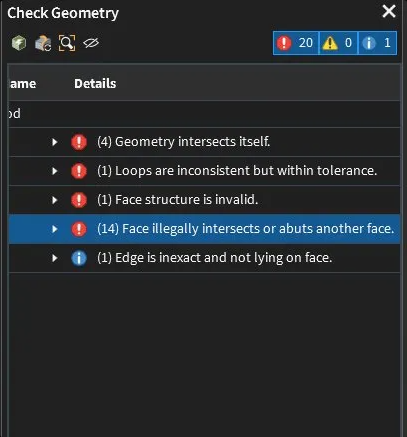
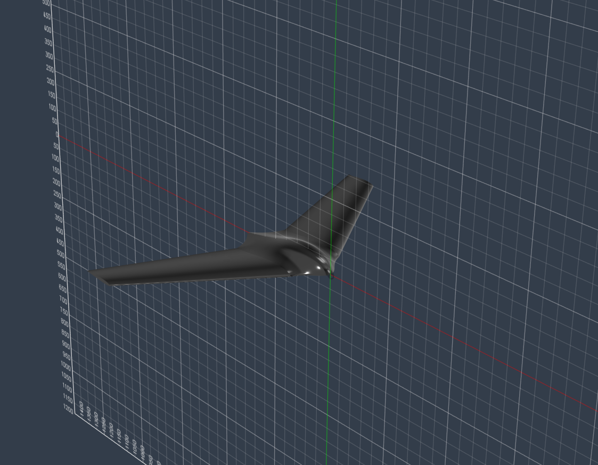

# CAD Workflow Fusion 360
 
This document describes the modeling process for the flying wing in Fusion 360. It covers the overall approach, the key decisions made along the way, and what didn't work and what we learned from it.
 
**Software:** Autodesk Fusion 360  
**Current model purpose:** CFD geometry only (ANSYS Fluent input)  
**File:** `cad/flying-wing.step`
 
> **Note:** This version of the model is prepared specifically for CFD simulation. It is a solid, closed body, not hollowed, no internal structure, no servo cutouts. The print-ready version will be a separate file developed in a later phase.
 
---
 
## Modeling Approach
 
The wing was built using a loft-based workflow, which gives precise control over the cross-sectional shape across the span. A guide rail (leading edge path) controls the transition geometry between root and tip profiles.
 
**Workflow overview:**
1. Import MH 45 airfoil profile (root)
2. Create offset plane -> sketch scaled tip profile with washout
3. Loft with leading-edge guide rail -> main wing body
4. Add pod geometry as well as guide rails to achieve the wanted pod form
5. Mirror wing to full span
6. Add rear boom (loft guided past a circle sketch, then extrude, trim intersections, fillet)
7. Add holm channel (sweep cut) (Not present in the CFD version)
8. Add winglets (To be redone)
9. Close elevon gaps for CFD (Not present in the CFD version)
---
 
## Key Decisions
 
**Airfoil import:** The MH 45 profile was imported from a `.dat` coordinate file. The raw file leaves a small gap at the trailing edge, this had to be closed manually before the loft would execute.
 
**Washout:** The tip profile was rotated ~2° (trailing edge up) to add geometric washout. In practice this resulted in the tip chord sitting 4mm above the root chordline, verified via Inspect → Measure.

 
**No shell for CFD:** The model is intentionally left as a solid body. CFD only sees the external surface, internal geometry is irrelevant for external aerodynamics. Hollowing is reserved for the print-ready version.

**Pod creation**: The pod body was created via the pod profile sketch to be lofted to the root of the wing. Several rails were created to achieve the pod form. In earlier versions the pod was attempted to be build as a seperate body and be assembled ontop of the wing. Not it is fully integrated into the main body.

**Rear boom:** the boom was created by sketching a circular profile on the rear face of the pod and lofting from the pod cross section into that circle. Guide rails were constrained tangent to the end circle so the rails close symmetrically into a clean round tail section. The boom lies on the centerline (X = 0) at roughly one third of the pod height, positioned so the pusher motor thrust line passes close to the CG. The boom carries the motor mount at its rear end.
---
 
## Challenges & What We Learned

### 
 
### Winglet geometry errors led to removal
 
The winglets initially showed 20 face intersection errors in ANSYS Discovery. The root cause was an imprecise transition between the winglet extrude and the swept wing surface: the faces were touching but not cleanly joined. Fusion's own geometry check showed no issues, which was misleading.
 
After repeated attempts to clean up the junction, the winglets were removed from the design entirely. The 33 deg sweep already provides a baseline of directional stability, so the airframe is flyable without them for a first prototype, and removing them eliminated the most problematic geometry on the model for both CAD and CFD. They can be revisited later as a reprinted tip section once a clean junction is worked out.
 
**Lesson:** Fusion's internal geometry validation is less strict than what CFD preprocessors require. Always validate the exported STEP in Discovery before starting mesh setup. If a junction cannot be made watertight, it is better to remove the feature than to fight an unclean geometry through meshing.

 
 
---
 
## Current Model State (CFD-ready) (No winglets)

