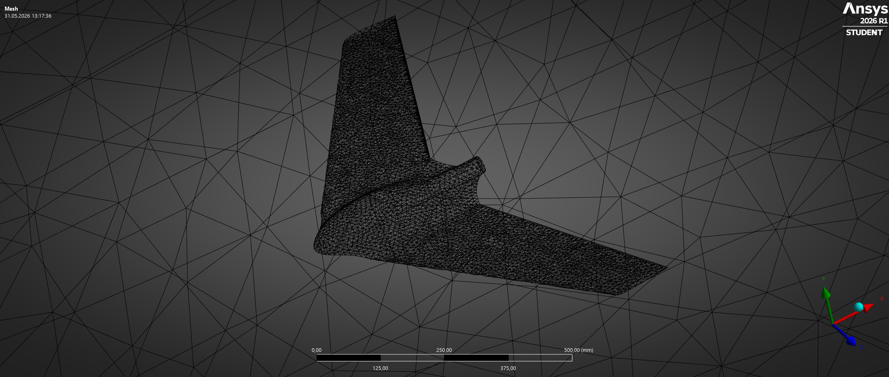
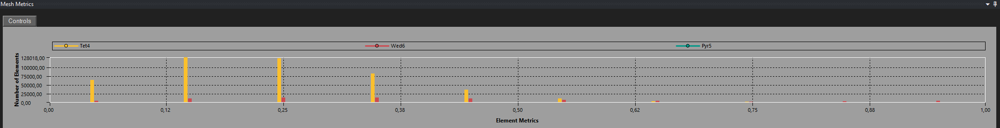
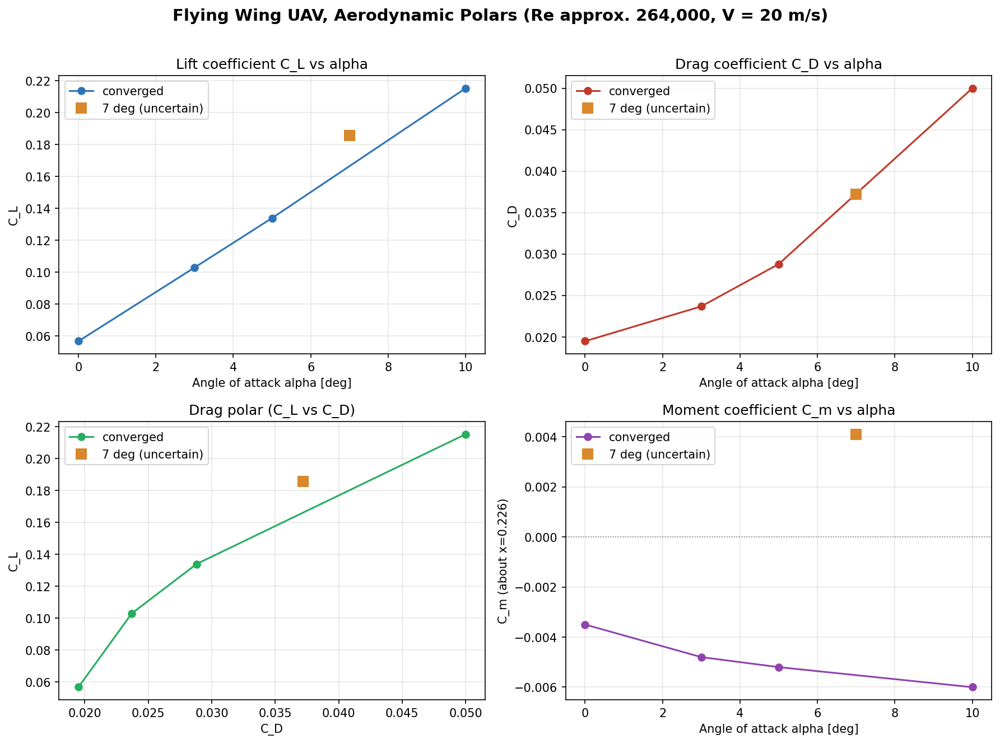
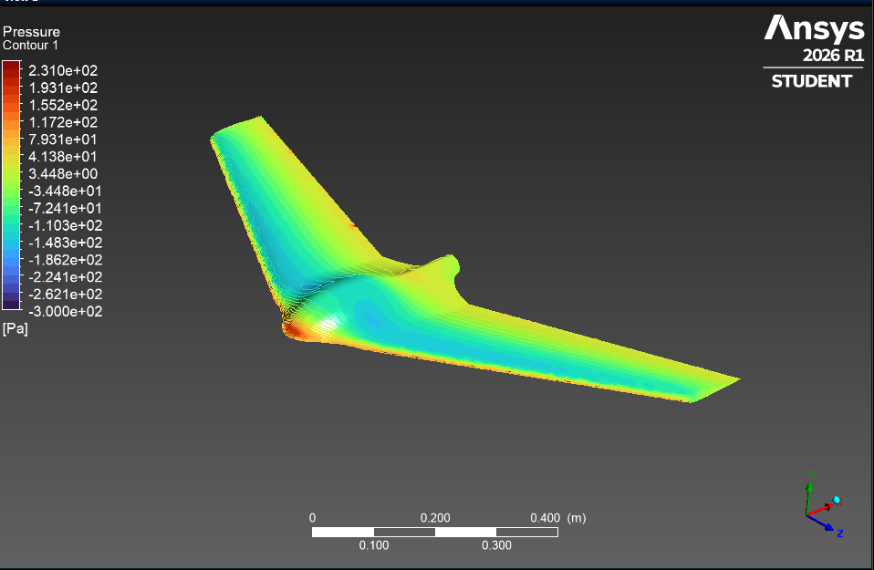
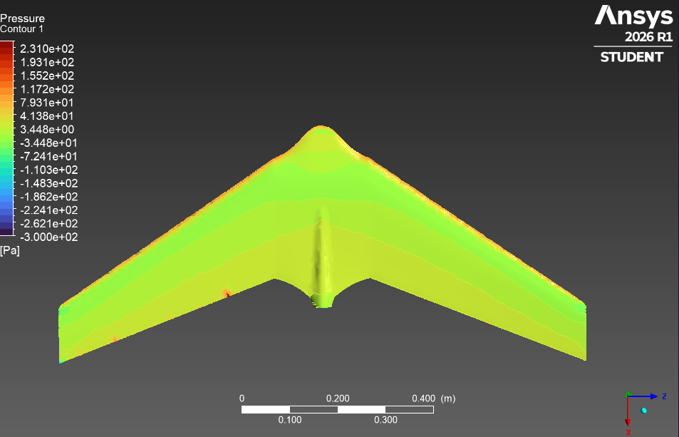
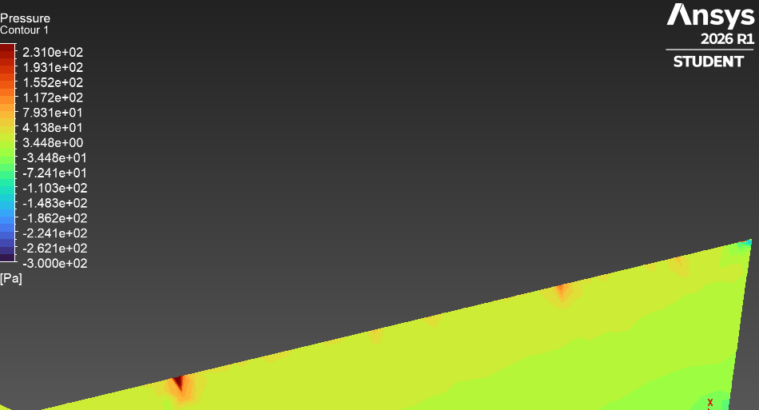
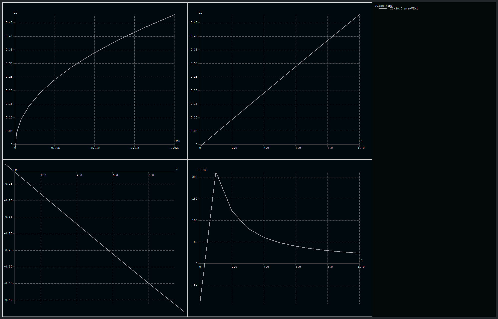

# CFD Analysis, ANSYS Fluent

This document covers the full CFD workflow for the flying wing: geometry preparation, mesh generation, solver setup, and the angle of attack polar used to assess aerodynamic performance and static stability.

**Software:** ANSYS Fluent 2026 R1 (Student License)
**Validation:** XFLR5
**Geometry input:** `cad/flying-wing.step`

**Status:** Angle of attack polar complete (0 to 10 degrees). Cross-checked against XFLR5; a refined-mesh spot check indicates the polar below under-predicts lift.
 
> **Note:** The ANSYS Student License is limited to 1,048,576 cells. This constraint influenced most meshing decisions below.

---

## Objectives

- Determine lift and drag coefficients (CL, CD) across the operating angle of attack range
- Build a polar curve and assess static stability via the pitching moment Cm
- Detect the onset of flow separation or pitch up
- Provide first order aerodynamic data to support the CG and stability layout

---

## Simulation Setup

### Geometry Preparation (Discovery)

The STEP file exported from Fusion 360 was imported into ANSYS Discovery for geometry validation. The model is the full flying wing including the central pod and the rear boom (no symmetry split). The wing solid was removed from the enclosure volume, leaving a fluid domain with a wing shaped cavity. The enclosure body was explicitly set to **Fluid**.

The enclosure was split into named boundary regions directly on the enclosure faces:

| Region | Boundary type | 
|--------|---------------|
| inlet | velocity inlet | 
| outlet | pressure outlet | 
| farfield | symmetry | 
| wing | wall (no slip) | 

Angle of attack was applied aerodynamically by tilting the inlet velocity vector, not by rotating the geometry. This keeps a single mesh valid for every angle of attack.

---

### Mesh

The final working mesh used a uniform coarse global size, a finer local size on the wing surface, and a thin inflation layer to begin resolving the boundary layer:

| Parameter | Value |
|-----------|-------|
| Physics / Solver preference | CFD / Fluent |
| Global element size | 200 mm |
| Wing surface (Named Selection) | 10 mm face sizing |
| Inflation (wing) | 5 layers, first layer 0.3 mm, growth rate 1.2 |
| Smoothing | High |
| Nodes | 117,698 |
| Elements | 517,381 |
| Average skewness | 0.260 (good) |
| Max skewness | 0.998 (single element at the trailing edge) |
| Wall y+ (average) | 8.0 |
| Wall y+ (maximum) | 20.0 |

The skewness histogram shows the bulk of elements between 0.13 and 0.45, which is healthy for an unstructured tetrahedral mesh. The maximum of 0.998 is a single degenerate element at the sharp trailing edge and does not affect overall solution stability. Refining the global mesh was observed to lower skewness further.

The wall y+ on the wing has an average of about 8 and a maximum of about 20. For the k-omega SST model this sits in the buffer layer, between the low y+ range (below 1, boundary layer fully resolved) and the wall function range (above 30). In this intermediate range neither approach is fully valid, which means the wall shear stress and therefore the viscous drag are only approximate. This is the main reason the absolute drag values below should be treated as first order estimates rather than precise figures.

> 
> 

---

### Fluent Setup

| Parameter | Value |
|-----------|-------|
| Solver | Pressure based, Steady |
| Turbulence model | k-omega SST |
| Reference area (A) | 0.229 m2 (projected planform) |
| Reference length (MAC) | 0.1931 m |
| Freestream velocity | 20 m/s |
| Density | 1.225 kg/m3 |
| Viscosity | 1.7894e-5 kg/(m s) |
| Reynolds number | approx. 264,000 |
| Turbulent intensity | 0.1 percent |
| Turbulent viscosity ratio | 10 |
| Pressure velocity coupling | SIMPLE |
| Gradient | Least Squares Cell Based |
| Spatial discretization | Second Order Upwind (momentum, k, omega, pressure) |
| Moment center | x = 0.226 m, moment axis (0, 0, 1) |

#### Angle of attack via inlet components

Velocity magnitude was held constant at 20 m/s, the angle was set through the X and Y components. The lift and drag report direction vectors were rotated by the same angle so that drag stays parallel to the freestream and lift perpendicular to it. The moment axis (spanwise, Z) is unchanged for all angles.

| AoA | Inlet X | Inlet Y | Drag direction (cos a, sin a, 0) | Lift direction (minus sin a, cos a, 0) |
|-----|---------|---------|----------------------------------|-----------------------------------------|
| 0 deg | 20.000 | 0.000 | (1.0000, 0.0000, 0) | (0.0000, 1.0000, 0) |
| 3 deg | 19.973 | 1.047 | (0.9986, 0.0523, 0) | (-0.0523, 0.9986, 0) |
| 5 deg | 19.924 | 1.743 | (0.9962, 0.0872, 0) | (-0.0872, 0.9962, 0) |
| 7 deg | 19.851 | 2.437 | (0.9925, 0.1219, 0) | (-0.1219, 0.9925, 0) |
| 10 deg | 19.696 | 3.473 | (0.9848, 0.1736, 0) | (-0.1736, 0.9848, 0) |

#### Convergence approach

First order upwind was used to establish a stable initial field, then momentum, k and omega were switched to second order on the converged field without re-initialising. Second order was essential: switching from first to second order on the 0 degree case reduced CD by roughly 37 percent (the first order result was artificially diffusive). Subsequent angle of attack cases were started from the previous converged solution rather than re-initialised, which converged faster.

---

## Results

### Aerodynamic Polar

All values at V = 20 m/s, Re approx. 264,000, fully second order, moment about x = 0.226 m.

| AoA | CL | CD | L/D | Cm |
|-----|------|------|------|------|
| 0 deg | 0.0567 | 0.0195 | 2.91 | -0.0035 |
| 3 deg | 0.1029 | 0.0237 | 4.34 | -0.0048 |
| 5 deg | 0.1339 | 0.0288 | 4.65 | -0.0052 |
| 7 deg | 0.1858 | 0.0372 | 4.99 | +0.0041 (unconverged, see note) |
| 10 deg | 0.2153 | 0.0500 | 4.31 | -0.0060 |

> 

CL rises monotonically and approximately linearly with angle of attack (dCL/da approx. 0.015 per degree), which is physically consistent. CD rises as expected. L/D peaks in the mid angle of attack range.

The absolute L/D values are modest for a wing. This is attributed to the viscous drag being overestimated by the coarse boundary layer resolution. As measured above, the wall y+ averages about 8 (max 20), which falls in the buffer layer where the SST model neither fully resolves the boundary layer nor cleanly applies wall functions, so the wall shear is approximate. The trends and coefficients are reliable as first order data, the absolute drag should be treated with caution and would improve with a finer near wall mesh (target y+ below 1).

---

### Pitching Moment and Static Stability

Cm about x = 0.226 m is negative and becoming more negative from 0 to 5 degrees (-0.0035 to -0.0052). A restoring nose down moment that strengthens with increasing angle of attack is the signature of a statically stable configuration, exactly what is required for a tailless flying wing.

The 7 degree point breaks this trend with Cm = +0.0041, but this case did not fully converge. The residuals climbed after about 600 iterations and the force values oscillated, indicating mildly unsteady flow. The 10 degree point returns to Cm = -0.0060, in line with the lower angle trend. The non monotonic Cm at 7 degrees is therefore most likely a numerical artefact of an unconverged, mildly unsteady solution rather than a true pitch up event. The 7 degree case should be re-run (lower under relaxation factors, a force monitor on Cm, more iterations) before being used quantitatively.

Taking the converged points (0, 3, 5, 10 degrees), the configuration shows stable static pitch behaviour across the tested range.

---

### Pressure Distribution

> 
> 
> 

The pressure field at 10 degrees angle of attack is physically consistent: stagnation and high pressure on the lower surface near the leading edge, strong suction on the upper surface concentrated toward the leading edge, and pressure recovery toward the trailing edge. A local pressure disturbance is visible at the pod to wing junction, expected given the geometric transition there. A few isolated, sharp pressure spikes appear at the trailing edge that do not match their smooth surroundings, these are numerical artefacts from the most distorted elements (skewness near 1) rather than real flow features, and being single cells among hundreds of thousands they have a negligible effect on the integrated forces.

## Validation: XFLR5 Cross-Check and Mesh Sensitivity
 
To check whether the polar above is physically reasonable, the lift-curve slope was compared against an independent method, and a single angle of attack was re-run on a finer mesh.
 
### Lift-curve slope vs. theory and XFLR5
 
The polar above gives a lift-curve slope of approximately **0.0155 per degree**. For this planform (aspect ratio ~4.85, quarter-chord sweep ~30 deg, MH 45 section), finite-wing theory predicts roughly **0.045-0.05 per degree**, which about three times higher.
 
The wing was rebuilt in **XFLR5** from the design parameters and analysed with the vortex-lattice method (VLM1). XFLR5 confirmed the geometry (aspect ratio 4.85, root-to-tip sweep 29.95 deg, taper 0.48, MAC 0.19 m) and returned a clean, near-linear CL-alpha curve reaching **CL ~= 0.48 at 10 deg**, i.e. a slope of **~0.048 per degree**, with a stable (negative) Cm-alpha slope. This is consistent with theory and roughly three times the CFD slope above.
 
The MH 45 section was also checked against published XFOIL data (airfoiltools.com, Re 200k, Ncrit 9): 2D section slope ~0.103 per degree with positive Cm0, confirming the airfoil itself is healthy. The conclusion is that the original mesh under-predicts lift, and the deficit is a CFD resolution issue, not a geometry or airfoil problem.
 
### Refined-mesh spot check (5 deg)
 
A finer wing surface mesh (7 mm faces with curvature capture, increased inflation layer count) was generated to better resolve the leading-edge suction peak, where most of the circulation is produced. The 5 deg case was re-run on this mesh:
 
| Quantity (5 deg) | Original mesh | Refined mesh |
|------------------|---------------|--------------|
| CL | 0.1339 | **0.1355** |
| Lift force | ~3.2 N | **7.60 N** |
 
The refined single-point result is consistent with the XFLR5 prediction, supporting the conclusion that resolving the leading-edge suction peak recovers the missing lift. A full refined polar is required to quantify the final slope.

> 

### What this means for the data above
 
- **Lift trends and stability (Cm)** are directionally reliable and confirmed stable by XFLR5.
- **Absolute lift** from the original polar is under-predicted; the XFLR5 slope (~0.048 /deg) is the better estimate until a full refined polar is run.
- **Absolute drag / L-D** remains first order (y+ ~8, fully-turbulent SST at low Re).
---

## Challenges and What We Learned

### Tip profiles not contained in the wing body

The first attempt produced force coefficients in the 10^6 range and violently oscillating residuals. The cause was that the wing tip profile faces were not part of the closed wing body. They formed open faces, so the corresponding boundaries were undefined and the solver produced meaningless values. Rebuilding the geometry with all tip profiles correctly contained in the wing body resolved it.

**Lesson:** Before meshing, confirm the wing body is fully closed. Open faces at tips or trailing edges give garbage CFD results, not just mesh failures.

### Enclosure not set to Fluid

Early meshes failed with no clear error message because the enclosure body was not explicitly set to Fluid in Discovery. The mesher could not determine which region was the flow domain.

**Lesson:** Always set the enclosure body to Fluid in Discovery before exporting. It is not automatic and there is no warning if it is missing.

### Student License cell limit

A 100 mm global mesh produced over 5 million elements, five times the limit. Reaching a usable count required tuning enclosure size and global sizing together. The final mesh (200 mm global, 10 mm on the wing, light inflation) came in at about 517,000 elements, comfortably within the limit.

**Lesson:** With a Student License, external aerodynamics sits at the edge of what is feasible. Enclosure size directly drives cell count, a smaller domain and coarse global sizing are necessary, at some cost to far field accuracy.

### Mesh failures with mixed sizing (no real fix yet found)

Combining a fine wing face sizing with a coarse global sizing repeatedly failed with the message that one or more surfaces could not be meshed with acceptable quality. The same settings sometimes worked after a restart and failed again unchanged. A working mesh was eventually achieved by establishing a stable base mesh first and applying local sizing and inflation carefully on top.

**Lesson:** On complex lofted geometry, get a uniform base mesh working before adding mixed sizing. Restart Meshing when behaviour becomes inconsistent.

### ANSYS Meshing inconsistency

Identical settings produced different results across sessions. A mesh that generated at one size would fail at another, then fail at the original after reapplication. Clearing generated data and restarting Workbench sometimes resolved failures without any setting change.

**Lesson:** When Meshing fails unexpectedly, clear generated data and restart Workbench before changing settings.

### Refining only the wing raised skewness
 
Refining just the wing surface to capture the geometry better actually increased skewness, because the large size jump between the fine wing cells and the coarse surrounding cells distorted the elements in the transition region. Skewness only improved when the global mesh was refined together with the wing, which in turn drove the cell count up toward the Student License limit.
 
**Lesson:** Local refinement cannot be decoupled from the surrounding mesh. Lowering skewness needs the global and local sizes refined together, so it is a direct trade-off against the cell limit.

### Solver divergence when changing schemes or initialising

Switching to second order on a freshly initialised field, or re-initialising after a scheme change, caused immediate divergence and once froze Fluent. Changing both turbulence intensity and discretisation order at the same time made the cause impossible to isolate.

**Lesson:** Change one thing at a time. Save Case and Data as a recovery point, switch to second order only on an already converged field without re-initialising, and reload the data instead of re-initialising if a run diverges.

### Validate absolute values against an independent method
 
The polar looked internally consistent (smooth, monotonic, physically sensible trends) yet under-predicted lift by ~3x. This was only caught by comparing the lift-curve slope against finite-wing theory and an XFLR5 vortex-lattice analysis. A CFD result can converge cleanly and still be quantitatively wrong.
 
**Lesson:** Cross-check key coefficients against an independent method (theory, XFLR5, published data) before trusting absolute values.
---

- Re-run the 7 degree case to convergence (lower under relaxation, force monitor on Cm) to confirm whether the positive Cm is real or numerical
- Determine the neutral point from the converged dCm/dCL slope and compute the static margin against the estimated CG
- Compare CL and CD against published MH 45 2D polar data as a sanity check
- Refine the near wall mesh to a low y+ 
