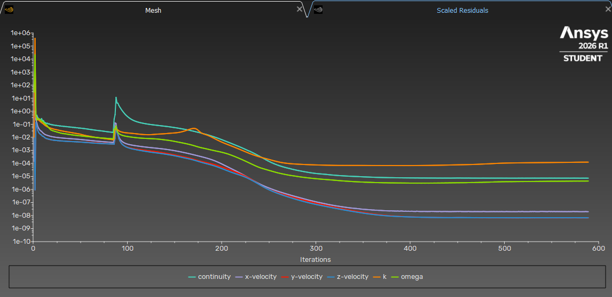
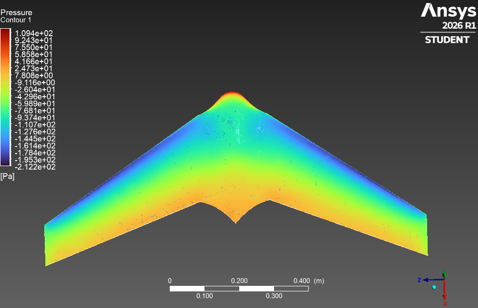
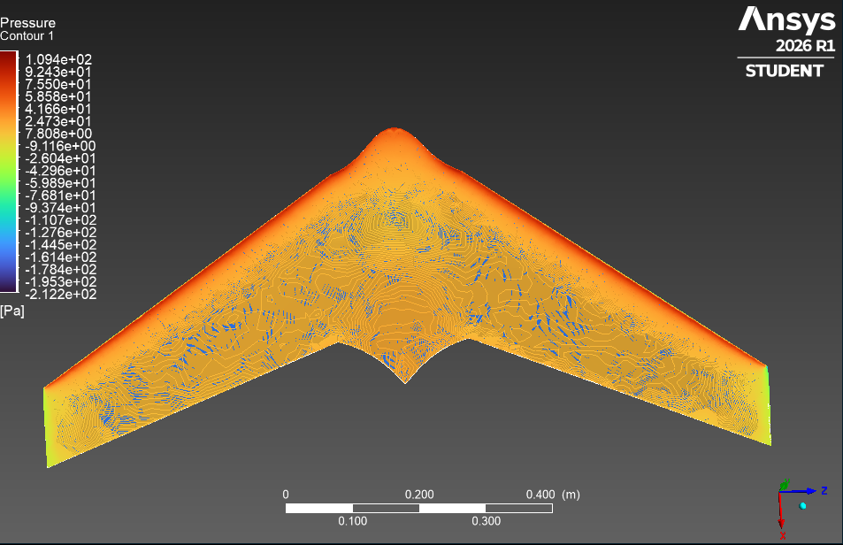

# CFD Analysis
 
This document covers the full simulation workflow for the flying wing, includig geometry preparation, mesh setup, solver configuration, and first results.
 
**Software:** ANSYS Fluent 2026 R1 (Student License)  
**Geometry input:** `cad/flying-wing.step`  
**Status:** First simulation complete ✅
 
> **Note:** The ANSYS Student License is limited to 1,048,576 cells. This imposed significant constraints on mesh resolution and influenced many decisions below.
 
---
 
## Simulation Setup
 
### Geometry Preparation (Discovery)
 
The STEP file exported from Fusion 360 was imported into ANSYS Discovery for geometry validation.
 
**Geometry Check results:**
- 1 harmless info: "Edge is inexact and not lying on face" at the pod junction

- Geometry accepted as CFD-ready
> 
 
The wing body was deleted from the enclosure volume, leaving only the fluid domain with the wing-shaped cavity. The enclosure body was explicitly set to **Fluid**.
 
**Flow domain dimensions:**
- Upstream / sides / top / bottom: 5500 mm
- Downstream: 11000 mm
The model includes the full wing (no symmetry split) rotated **7° nose-up** to set the angle of attack geometrically, referenced approximately to the estimated center of gravity.
 
---
 
### Mesh
 
**Settings:**
- Global element size: 215 mm
- Smoothing: High
**Mesh statistics:**
- Nodes: 190,508
- Elements: 1,045,206 *(just within Student License limit)*
- Average Skewness: 0.225 (good)
- Max Skewness: 0.843 (acceptable)

> 
 
---
 
### Fluent Setup
 
| Parameter | Value |
|-----------|-------|
| Solver | Pressure-Based, Steady |
| Turbulence model | k-ω SST |
| Inlet velocity | 15 m/s |
| Outlet | Pressure outlet, 0 Pa |
| Farfield | Symmetry |
| Wall (wing) | No-slip wall |
| Solution scheme | SIMPLE |
| Spatial discretization | Second Order Upwind |
| Convergence criterion | 1e-5 (all residuals) |
| Iterations | 500 |
 
---
 
## Results
 
### Convergence
 
The simulation converged after ~500 iterations. Most residuals dropped below 1e-5; continuity stabilized around 1e-5, k around 1e-4 — acceptable for a first run on a coarse mesh.
 
> 
 
---
 
### Aerodynamic Coefficients
 
**Conditions:** AoA = 7°, V = 15 m/s, ρ = 1.225 kg/m³
 
| Quantity | Value |
|----------|-------|
| Lift Force | 17.74 N |
| Drag Force | 1.20 N |
| **CL** | **0.1287** |
| **CD** | **0.0087** |
| **L/D** | **14.8** |
| Cm (about approx. CG) | 0.01873 |
 
L/D = 14.8 is a reasonable result for a flying wing at this scale and speed. These values should be treated as first-order estimates given the coarse mesh resolution.
 
---
 
### Pitching Moment & Stability
 
Cm = **+0.01873** about the estimated CG (located approximately 80 mm ahead of the pod nose).
 
A positive Cm indicates a nose-up pitching moment at this operating point. This suggests the current CG estimate may be aft of the neutral point, which would imply the configuration is statically unstable at this condition. A second simulation at a different AoA is needed to determine the neutral point location — this is planned as the next step.
 
---
 
### Pressure Distribution

> 
> 
 
The pressure distribution is physically consistent:
- High pressure on the lower surface — stagnation at the leading edge, pressure recovery toward the trailing edge
- Low pressure on the upper surface, concentrated near the leading edge
- A local pressure disturbance visible at the pod-wing junction, expected given the geometric transition there
---
 
### Streamlines
 

---
 
## Challenges & What We Learned
 
 
### Student License cell limit
 
The first mesh at 100 mm global sizing produced over 5 million elements. The final working mesh (215 mm, full wing, smaller enclosure) came in at 1,045,206. Getting there required multiple failed attempts at different sizing and enclosure combinations.
 
**Lesson:** With a Student License, external aerodynamics is at the edge of what's feasible. Enclosure size and global sizing need to be tuned carefully together. Inflation layers are effectively impossible within the cell limit.
 
 
### Pod surface intersection errors
 
The pod-wing junction produced "surface mesh is intersecting" errors in multiple attempts. This is a carry-over from the CAD geometry, the junction was never fully clean in Fusion (documented in the CAD notes). The working solution was to manually delete the wing solid from the enclosure volume rather than relying on the automatic Enclosure subtraction tool.
 
 
---
 
## Next Steps
 
- Run simulation at additional AoA values (0°, 3°, 5°, 10°) to build a polar curve
- Extract Cm at each AoA to locate the neutral point and assess static stability margin
- Compare CL/CD results against published MH 45 2D polar data as a sanity check
